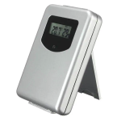
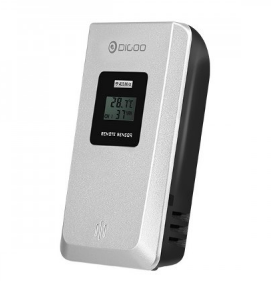
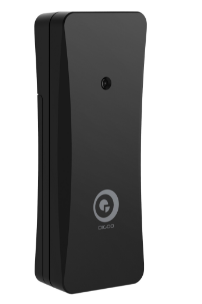
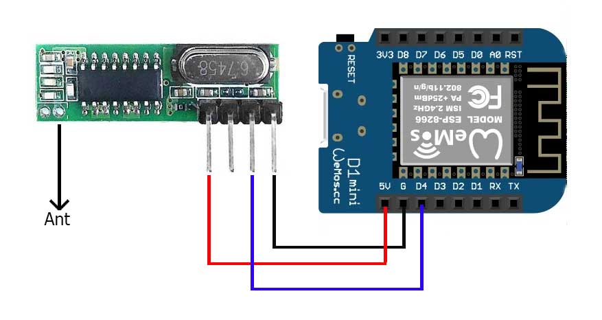

# WeatherStation outdoor sensor receiver
The project is weather station outdoor sensor unit receiver firmware for esp8266. 
This sensors used in most cheap Chinese weather monitors. It measures temperature and humidity and sends 433 MHz OOK  modulated signal in 3-7 meters distance.

# Known sensors
| Sensor | Description |
|---|---|
|| Most popular outdoor sensor. <br />It has no model name but can be found easly on most China marketplaces for about $7-$10 .<br /> IPX3 waterproof level. <br /> If sensor data dosn't received see [Troubleshooting](#Troubleshooting) |   
|| Digoo outdoor sensor. Mine model R8S .<br />Size : 60mm x 34mm x 96mm|   
|| Digoo outdoor sensor. Model R8H .<br /> Has a little different protocol, but still works pretty good|   


# Compile
platformio required to compile firmware.
```
make && make upload
``` 

# Schematics
433Mhz receiver should be connected to ESP8266. Default in pin D4. 



# Troubleshooting
Most sensors works with the same protocol, but some time timings differ. If you have a luck sensor will be received after timings fix.<br />
Call _WeatherStationSensor::setup(const rftimings_t &t)_ where rftimings_t describes the aprropative protocol. For example :
```
unit.setup({950,8,4,2})
``` 
Means 950 uSec tick, 8 ticks packet gap, 4 ticks for one and 2 ticks for zero bit.

# License

MIT. See License file


